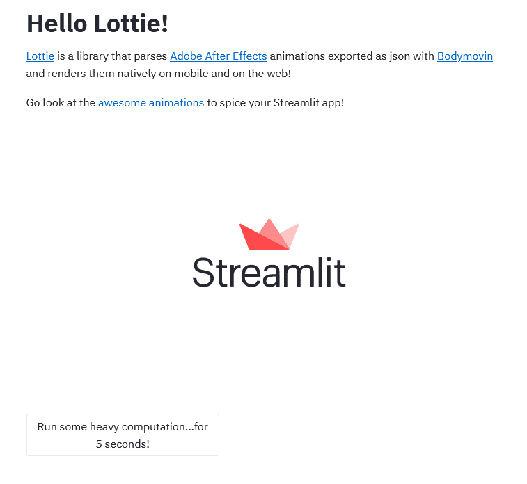

# Streamlit Lottie

[](https://share.streamlit.io/andfanilo/streamlit-lottie-demo/master/app.py)

Integrate [Lottie](https://lottiefiles.com/) animations inside your Streamlit app!



## Install

```
pip install streamlit-lottie
```

## Usage

```python
from streamlit_lottie import st_lottie

def load_lottieurl(url: str):
    r = requests.get(url)
    if r.status_code != 200:
        return None
    return r.json()

lottie_url = "https://assets5.lottiefiles.com/packages/lf20_V9t630.json"
lottie_json = load_lottieurl(lottie_url)
st_lottie(lottie_json)
```

## Development

### Install

- JS side

```shell script
cd frontend
npm install
```

- Python side

```shell script
conda create -n streamlit-lottie python=3.7
conda activate streamlit-lottie
pip install -e .
```

### Run

Both webpack dev server and Streamlit need to run for development mode.

- JS side

```shell script
cd frontend
npm run start
```

- Python side

```shell script
streamlit run app.py
```

## References

- [Lottie-web (Official)](https://github.com/airbnb/lottie-web)
- [react-lottie (chenqingspring)](https://github.com/chenqingspring/react-lottie)
- [lottie-react-web (felippenardi)](https://github.com/felippenardi/lottie-react-web)
- [lottie-react (gamote)](https://github.com/gamote/lottie-react)
- [lottie-react (LottieFiles)](https://github.com/LottieFiles/lottie-react)
- [react-lottie-player (mifi)](https://github.com/mifi/react-lottie-player)
- [lottie-interactivity](https://github.com/LottieFiles/lottie-interactivity)

# Support me

<a href="https://www.buymeacoffee.com/andfanilo" target="_blank"></a>
